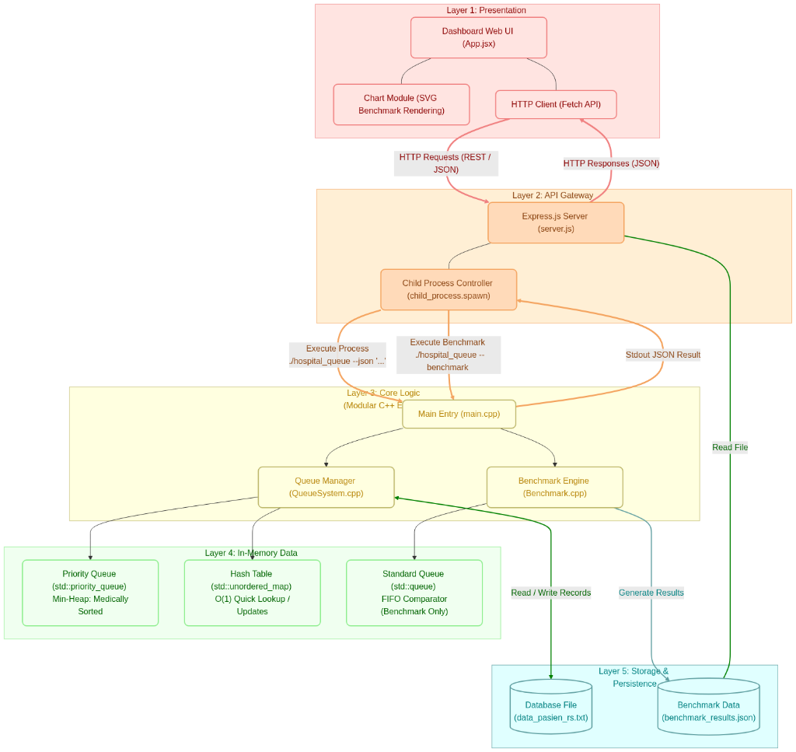

# 🏥 Sistem Antrian Rumah Sakit Terintegrasi (Hospital Queue System)

Program sistem antrian rumah sakit terintegrasi yang menggabungkan **Modular C++ Engine** (Priority Queue & Hash Table) dengan **Web Admin Dashboard** berbasis **Node.js (Express)** dan **React (Vite)**.

---

## 3. Desain Arsitektur Program

Arsitektur 5-Layer terintegrasi:



---

## ⚡ Fitur Utama

### Skala Prioritas Medis
Urutan pelayanan pasien ditentukan oleh tingkat kegawatan medis berikut:

| Tingkat Prioritas | Kategori | Contoh Kasus |
| :---: | :---: | :--- |
| **1** | Darurat (Emergency) | UGD, kecelakaan, kondisi kritis mengancam nyawa. |
| **2** | Mendesak (Urgent) | Nyeri hebat, demam sangat tinggi. |
| **3** | Rentan (Vulnerable) | Lansia, ibu hamil, penyandang disabilitas. |
| **4** | Reguler (Regular) | Pemeriksaan rutin, poli umum biasa. |

### Operasional Utama
* **Check-in Terjadwal**: Registrasi online (`TERJADWAL`) tidak masuk antrian aktif memori (heap) sebelum check-in fisik di loket menjadi `MENUNGGU`.
* **Waktu Panggil Otomatis**: Jam panggil (`waktuDipanggil`) dicatat otomatis oleh system clock saat memanggil pasien (`call_next`).
* **Persistensi File**: Data otomatis disinkronisasikan ke file flat-file `data_pasien_rs.txt`.
* **Benchmark Performa**: Membandingkan kecepatan operasi Priority Queue (Min-Heap) vs Standard Queue (FIFO) secara realtime.

---

## 3.2 Struktur Data yang Digunakan

### Struct
Diimplementasikan sebagai representasi model data pasien pada [Patient.h](include/Patient.h).
```cpp
struct Patient {
    std::string id;
    std::string nama;
    std::string layanan;
    int prioritas;
    std::string nomorAntrian;
    std::string waktuDatang;
    std::string waktuDipanggil;
    std::string tanggal;
    StatusLayanan status;
};
```

### Queue
Diimplementasikan sebagai pembanding antrian standar (FIFO) di [Benchmark.cpp](src/Benchmark.cpp).
```cpp
std::queue<Patient> q;
```

### Priority Queue
Diimplementasikan sebagai heap pengurutan antrian aktif pasien di [QueueSystem.h](include/QueueSystem.h).
```cpp
std::priority_queue<Patient, std::vector<Patient>, ComparePatient> antrian;
```

### Hash Table
Diimplementasikan sebagai pencarian instan O(1) untuk update status dan pencarian ID pasien di [QueueSystem.h](include/QueueSystem.h).
```cpp
std::unordered_map<std::string, Patient> dataPasien;
```

---

## 🚀 Panduan Menjalankan Program

### A. Terminal Only
Menjalankan program langsung menggunakan Command Line Interface (CLI).

1. **Kompilasi Program**:
   ```bash
   make clean && make
   ```
2. **Jalankan Menu Interaktif**:
   ```bash
   ./hospital_queue
   ```
3. **Gunakan JSON CLI (Command-Line Mode)**:
   ```bash
   # Masukkan data dummy simulasi
   ./hospital_queue --json '{"action":"dummy_data"}'

   # Baca seluruh antrian pasien
   ./hospital_queue --json '{"action":"list_all"}'

   # Panggil pasien berikutnya dari heap
   ./hospital_queue --json '{"action":"call_next"}'
   ```

### B. Web App
Menjalankan dashboard administratif terintegrasi berbasis browser.

*Prasyarat: Pastikan C++ binary sudah di-compile (`make`).*

1. **Jalankan API Backend (Express.js)**:
   ```bash
   cd web/backend
   npm install
   node server.js
   ```
   *(Backend berjalan di `http://localhost:7331`)*

2. **Jalankan Dev Server Frontend (React + Vite)**:
   ```bash
   cd web/frontend
   npm install
   npm run dev
   ```
   *(Frontend berjalan di `http://localhost:5173/`)*

3. **Akses Dashboard**:
   Buka browser dan buka **`http://localhost:5173/`**.
