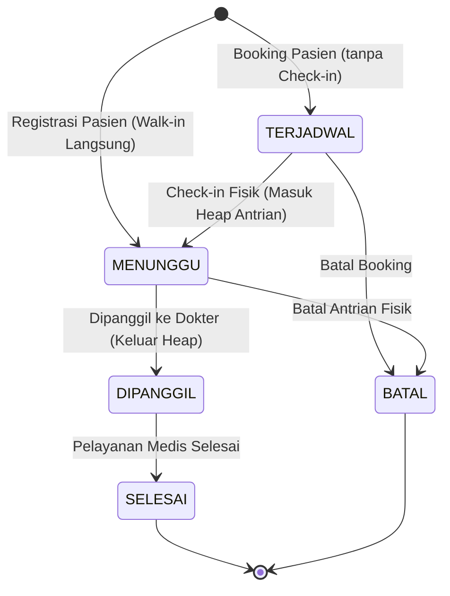

# Aturan & Batasan Sistem

Dokumen ini mendefinisikan aturan bisnis utama, skema prioritas, spesifikasi data, dan batasan status pada Sistem Antrian Rumah Sakit terintegrasi.

---

## 1. Spesifikasi Data Domain

Setiap record data pasien harus berisi field-field berikut:

| Nama Field | Tipe Data | Batasan / Aturan | Deskripsi |
|---|---|---|---|
| **ID Pasien** | `string` | Harus unik. Tidak boleh kosong. | Kode unik pengenal pasien (misal: `P001`). |
| **Nama Pasien** | `string` | Tidak boleh kosong. | Nama lengkap pasien. |
| **Jenis Layanan** | `string` | Tidak boleh kosong. | Unit/Poli tujuan (misal: `Poli Umum`, `UGD`, `Laboratorium`). |
| **Tingkat Prioritas** | `int` | Rentang: `1` hingga `4` (1 tertinggi). | Kategori penentu urutan pelayanan. |
| **Nomor Antrian** | `int` | Auto-increment, unik. | Nomor urut yang didapatkan saat registrasi. |
| **Waktu Kedatangan** | `string` | Format: `HH:MM` (24 jam) atau `-`. | Waktu check-in fisik aktual pasien di lokasi loket. Bernilai `-` jika pasien belum check-in. |
| **Waktu Dipanggil** | `string` | Format: `HH:MM` (24 jam) atau `-`. | Waktu ketika pasien dipanggil oleh dokter. Bernilai `-` jika pasien masih mengantri atau belum datang. |
| **Tanggal Appointment** | `string` | Format: `YYYY-MM-DD`. | Tanggal kunjungan terjadwal pelayanan pasien. |
| **Status Layanan** | `enum` | Nilai: `0` (Menunggu), `1` (Dipanggil), `2` (Selesai), `3` (Batal), `4` (Terjadwal). | Status alur pelayanan pasien saat ini. |

### 1.1 Penjelasan Detil Desain Waktu & Tanggal

Untuk menjaga kebersihan data (data integrity) dan optimalisasi performa pencarian, informasi penjadwalan dipecah menjadi dua field terpisah:

1. **Tanggal Appointment (`tanggal`)**:
   * **Definisi**: Tanggal terjadwal pasien untuk berobat (misal: `2026-06-03`).
   * **Peran**: Membantu petugas memfilter database pasien berdasarkan hari operasional secara efisien tanpa perlu melakukan parsing datetime yang rumit.
2. **Arrival Time / Waktu Datang (`waktuDatang`)**:
   * **Definisi**: Jam ketika pasien datang ke rumah sakit untuk melakukan konfirmasi booking/check-in fisik (misal: `08:15`).
   * **Peran**: Digunakan sebagai penentu urutan (tie-breaker FIFO) pada antrian dengan tingkat prioritas yang sama. Pasien yang check-in lebih dulu pada tanggal tersebut akan mendapatkan nomor antrian lebih kecil dan dilayani lebih dulu.

*Catatan: Selisih antara jam check-in fisik (`waktuDatang`) dan jam ketika status diubah menjadi `DIPANGGIL` merepresentasikan durasi waktu tunggu aktual pasien (Wait Time).*

---

## 2. Hierarki Prioritas

Sistem menggunakan priority queue untuk mengurutkan pelayanan pasien berdasarkan tingkat prioritas terlebih dahulu, kemudian berdasarkan nomor kedatangan (nomor antrian) jika tingkat prioritasnya sama.

| Tingkat Prioritas | Kategori | Deskripsi / Contoh Kasus |
| :---: | :---: | :--- |
| **1** | **Darurat (Emergency)** | UGD, kecelakaan, serangan jantung, kondisi kritis mengancam nyawa. |
| **2** | **Mendesak (Urgent)** | Nyeri berat, demam sangat tinggi, kondisi butuh penanganan segera. |
| **3** | **Rentan (Vulnerable)** | Lansia, ibu hamil, penyandang disabilitas. |
| **4** | **Reguler (Regular)** | Pemeriksaan rutin, poli umum biasa. |

### Logika Pengurutan (Min-Heap pada Kode Prioritas)
Misalkan terdapat pasien $A$ dan pasien $B$ di dalam antrian:
1. Jika $A.\text{prioritas} < B.\text{prioritas}$, maka $A$ dilayani lebih dulu dari $B$.
2. Jika $A.\text{prioritas} == B.\text{prioritas}$, maka $A$ dilayani lebih dulu jika $A.\text{nomorAntrian} < B.\text{nomorAntrian}$ (menjaga aturan FIFO).

---

## 3. State Machine Status Layanan

Status pasien wajib berubah secara konsisten mengikuti diagram transisi berikut untuk mencegah inkonsistensi data:

### Aturan Transisi
* **Transisi yang Diperbolehkan:**
  * `TERJADWAL` $\rightarrow$ `MENUNGGU` (Check-in fisik saat tiba di RS).
  * `TERJADWAL` $\rightarrow$ `BATAL` (Batal booking janji temu).
  * `MENUNGGU` $\rightarrow$ `DIPANGGIL` (Pasien dipanggil dokter masuk ruangan).
  * `DIPANGGIL` $\rightarrow$ `SELESAI` (Pemeriksaan medis selesai).
  * `MENUNGGU` $\rightarrow$ `BATAL` (Batal mengantri setelah check-in).
* **Transisi yang Dilarang:**
  * Transisi apa pun dari status `SELESAI` atau `BATAL` (status final tidak bisa diubah lagi).
  * Transisi langsung dari `TERJADWAL` ke `DIPANGGIL` (pasien wajib datang fisik dan check-in `MENUNGGU` dulu agar masuk Priority Queue heap).
  * Transisi dari `DIPANGGIL` ke `BATAL` (pelayanan sedang berjalan tidak boleh langsung dibatalkan sebelum diselesaikan).

### 3.1 Perbedaan Status Antrian Pasien

1. **TERJADWAL (Scheduled)**:
   * Pasien baru melakukan booking online atau terdaftar untuk hari kunjungan, tetapi **belum tiba secara fisik** di rumah sakit.
   * Pasien berstatus ini **tidak dimasukkan ke dalam Priority Queue aktif (heap)** di memori.
   * Nilai `waktuDatang` dan `waktuDipanggil` bernilai `"-"` (belum ada).
2. **MENUNGGU (Waiting)**:
   * Pasien sudah check-in secara fisik di rumah sakit dan **masuk ke dalam Priority Queue aktif (heap)** di memori.
   * Urutan pasien ditentukan oleh tingkat prioritas (1-4) dan nomor antrian (FIFO) jika prioritasnya sama.
   * Pasien secara fisik berada di ruang tunggu menanti giliran nomor antriannya dipanggil.
3. **DIPANGGIL (Called)**:
   * Nomor antrian pasien dipanggil oleh petugas/dokter. Data pasien **dikeluarkan (pop) dari Priority Queue aktif** agar pasien berikutnya bisa bergeser naik.
   * Status pasien diubah menjadi `DIPANGGIL` di dalam Hash Table.
   * Waktu saat tombol panggil ditekan akan secara otomatis dicatat sebagai `waktuDipanggil`.
   * Pasien saat ini secara fisik berada di dalam ruang pemeriksaan dan sedang menjalani tindakan medis bersama dokter.

---

## 4. Aturan Arsitektural

1. **Konsistensi Struktur Ganda**: Data wajib sinkron antara `Priority Queue` (untuk alur pemanggilan urutan) dan `Hash Table` (untuk pencarian, update status, dan pembatalan instan $O(1)$).
2. **Persistensi File**: Setiap perubahan data (`insert`, `update`, `cancel`, `call`) harus otomatis disimpan ke file penyimpanan (`data_pasien_rs.txt`) untuk mencegah kehilangan data.
3. **Desain Modular**: Kode C++ wajib dipisah ke dalam header (`.h`) dan source (`.cpp`) untuk menjaga kualitas, keterbacaan, dan modularitas sistem.
