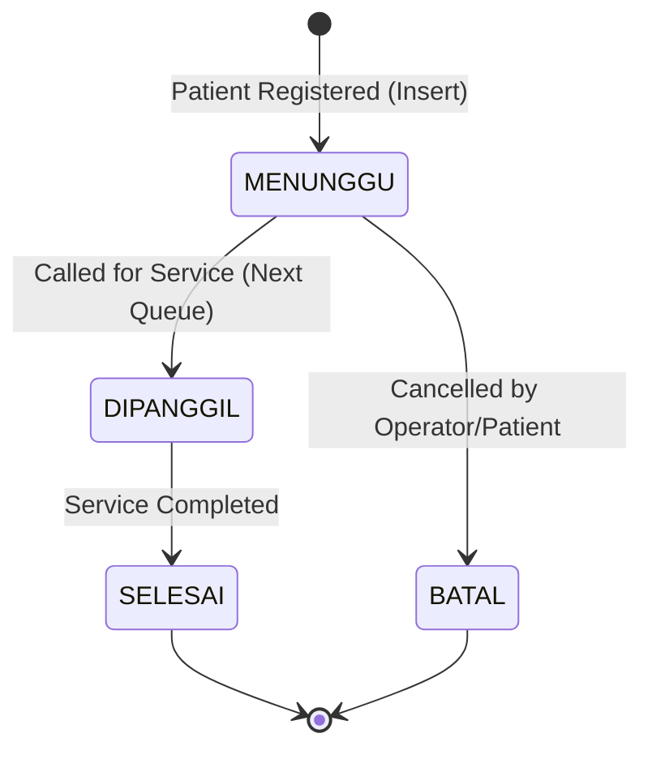

# System Rules & Constraints

This document defines the core business rules, priority schemes, data specifications, and state constraints of the integrated Hospital Queue System.

---

## 1. Domain Data Specifications

Every patient record must contain the following fields:

| Field Name | Type | Constraints / Rules | Description |
|---|---|---|---|
| **Patient ID** | `string` | Must be unique. Cannot be empty. | Unique identifier (e.g., `P001`). |
| **Patient Name** | `string` | Cannot be empty. | Full name of the patient. |
| **Service Type** | `string` | Cannot be empty. | Target clinic (e.g., `Poli Umum`, `UGD`, `Laboratorium`). |
| **Priority Level** | `int` | Range: `1` to `4` (1 is highest). | Category determining queue order. |
| **Queue Number** | `int` | Auto-incrementing, unique. | Assigned sequentially upon registration. |
| **Arrival Time** | `string` | Format: `HH:MM` (24-hour). | Time when patient checked in. |
| **Tanggal Appointment** | `string` | Format: `YYYY-MM-DD`. | Scheduled date of visit. |
| **Service Status** | `enum` | Values: `0` (Waiting), `1` (Called), `2` (Finished), `3` (Cancelled). | Current status of the patient in the workflow. |

---

## 2. Priority Hierarchy

The system operates on a priority queue where patients are ordered by their priority tier first, and then by their arrival sequence (Queue Number) if they share the same priority tier.

| Priority Tier | Category | Description / Examples |
| :---: | :---: | :--- |
| **1** | **Darurat (Emergency)** | UGD, accidents, heart attacks, life-threatening conditions. |
| **2** | **Mendesak (Urgent)** | Severe pain, high fever, conditions needing prompt attention. |
| **3** | **Rentan (Vulnerable)** | Elderly (lansia), pregnant women (ibu hamil), people with disabilities. |
| **4** | **Reguler (Regular)** | Routine checkups, general polyclinic consults. |

### Sorting Logic (Min-Heap behavior on Priority Code)
Let patient $A$ and patient $B$ be in the queue:
1. If $A.\text{priority} < B.\text{priority}$, then $A$ is served before $B$.
2. If $A.\text{priority} == B.\text{priority}$, then $A$ is served before $B$ if $A.\text{queueNumber} < B.\text{queueNumber}$ (FIFO preservation).

---

## 3. Service Status State Machine

A patient's status must transition strictly according to the following state machine to maintain database and queue consistency:

### Transition Rules
* **Allowed Transitions:**
  * `MENUNGGU` $\rightarrow$ `DIPANGGIL`
  * `DIPANGGIL` $\rightarrow$ `SELESAI`
  * `MENUNGGU` $\rightarrow$ `BATAL` (Cancelled)
* **Forbidden Transitions:**
  * Any transition from `SELESAI` or `BATAL` is illegal (final states).
  * Direct transition from `MENUNGGU` to `SELESAI` is forbidden (must be called first).
  * Direct transition from `DIPANGGIL` to `BATAL` is forbidden (once called, service must be completed).

---

## 4. Architectural Rules

1. **Dual Structure Consistency**: The data must be synchronized between the `Priority Queue` (used for retrieval of the next patient) and the `Hash Table` (used for $O(1)$ search, updates, and cancellations).
2. **File Persistence**: Every write operation (`insert`, `update`, `cancel`, `call`) must automatically save the current state to the persistent data file (`data_pasien_rs.txt`) to prevent data loss.
3. **Modular Design**: Code must be separated into clean header (`.h`) and source (`.cpp`) files to ensure high code quality, testability, and clean separation of concerns.
