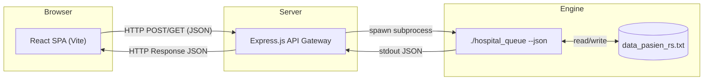

# UI Implementation Plan

Detailed page structure, component breakdown, and element-level design specification for the Hospital Queue System web dashboard. Every section, element, and interaction is documented to the point of implementation clarity.

Reference: [DESIGN.md](DESIGN.md) for color tokens, typography, spacing, and component specs.

---

## 1. Architecture Overview

The frontend is a **single-page React application** (React + Vite) that communicates with a Node.js/Express backend via REST JSON endpoints. The backend spawns a compiled C++ binary for every operation.



### Navigation Model

The app uses **tab-based navigation** within a single layout shell. There is no multi-page routing (no React Router). Content switches via conditional rendering based on `activeTab` state.

---

## 2. Application Shell (Persistent Layout)

The shell wraps every page and is always visible. It consists of three persistent zones.

### 2.1 Top Navigation Bar (Navbar)

A horizontal bar fixed to the top of the viewport.

```
┌──────────────────────────────────────────────────────────────────────────┐
│  [Logo + Title]                              [Clock] [Actions]          │
└──────────────────────────────────────────────────────────────────────────┘
```

#### Element Breakdown

| Element | Type | Spec |
|---|---|---|
| **Logo/Title** | Text | `Playfair Display 700`, `--text-2xl`, `--text-primary`. Text: "Sistem Antrian RS". No emoji. Optional small hospital icon (Lucide `hospital`) at 24px beside it. |
| **Subtitle** | Text | `Inter 400`, `--text-sm`, `--text-secondary`. Text: "Administrative Dashboard". Positioned directly below title. |
| **Live Clock** | Text + Icon | Lucide `clock` icon 16px + time string `HH:MM:SS` in `JetBrains Mono 400`, `--text-base`. Updated every second. Contained in a subtle `--surface-sunken` pill with `--border-default`. |
| **Refresh Button** | Button (Secondary) | Lucide `refresh-cw` icon + "Refresh". Calls `GET /api/patients`. |
| **Load Dummy Button** | Button (Secondary) | Lucide `database` icon + "Load Dummy Data". Calls `POST /api/dummy` after confirm dialog. |

#### Navbar Styling

```
Background:    --surface-raised
Border-bottom: 1px solid --border-default
Height:        64px
Padding:       0 --space-8
Shadow:        --shadow-card (subtle, only to separate from content)
Position:      sticky, top: 0, z-index: 100
Layout:        flex, justify-content: space-between, align-items: center
```

#### Mobile Behavior
- Title truncates to "Antrian RS"
- Action buttons collapse into a `⋯` overflow menu (Lucide `more-horizontal`)
- Clock remains visible

---

### 2.2 Statistics Bar

A row of four summary cards placed directly below the navbar. Always visible regardless of active tab.

```
┌────────────┐  ┌────────────┐  ┌────────────┐  ┌────────────┐
│  Menunggu   │  │  Terjadwal │  │  Dipanggil  │  │  Selesai    │
│     12      │  │      5     │  │      1      │  │     34      │
└────────────┘  └────────────┘  └────────────┘  └────────────┘
```

#### Element Breakdown (per card)

| Element | Spec |
|---|---|
| **Container** | `--surface-raised`, `--radius-lg`, `--shadow-card`, padding `--space-5` |
| **Icon** | Lucide icon, 28px, colored with corresponding `--status-{state}` token |
| **Label** | `Inter 500`, `--text-xs`, uppercase, `letter-spacing: 0.06em`, `--text-secondary` |
| **Value** | `Playfair Display 700`, `--text-xl`, `--text-primary` |

#### Icons per Stat
- Menunggu: `clock` — `--status-waiting`
- Terjadwal: `calendar-check` — `--status-scheduled`
- Dipanggil: `megaphone` — `--status-called`
- Selesai: `check-circle` — `--status-completed`

#### Layout
- Desktop: `grid, 4 columns, gap --space-6`
- Tablet: `grid, 2 columns`
- Mobile: `grid, 2 columns`, reduced padding

---

### 2.3 Tab Bar (Page Navigation)

Horizontal underline-style tab bar. Positioned below the stats bar.

```
  Antrian Aktif (13)    Terjadwal (5)    Riwayat (38)    Analisis Performa
  ━━━━━━━━━━━━━━━━
```

#### Tab Items

| Tab ID | Label | Count Source | Description |
|---|---|---|---|
| `active` | Antrian Aktif | `status === 0` + `status === 1` | Patients currently waiting or being called |
| `scheduled` | Terjadwal | `status === 4` | Patients with bookings, not yet checked in |
| `history` | Riwayat | `status === 2` + `status === 3` | Completed and cancelled patients |
| `benchmark` | Analisis Performa | — (no count) | Benchmark comparison view |

#### Tab Styling

```
Container:      border-bottom 1px solid --border-default, padding-bottom 0
Tab text:       Inter 500, --text-base, --text-secondary
Active tab:     --text-primary, weight 600, bottom-border 3px solid --accent-primary
Hover:          --text-primary
Count badge:    --text-tertiary, in parentheses, same font
Tab gap:        --space-8 (32px)
Tab padding:    --space-4 bottom (16px, clearance for underline)
```

---

## 3. Page: Antrian Aktif (Tab: `active`)

The primary operational view. Split into two zones.

### Layout

```
┌────────────────────────────────────────────┬──────────────────────────┐
│                                            │                          │
│          Calling Deck (Top Half)           │   Registration Form      │
│                                            │   (Sticky Sidebar)       │
│────────────────────────────────────────────│                          │
│                                            │                          │
│          Patient Queue Table               │                          │
│          (Bottom Half)                     │                          │
│                                            │                          │
└────────────────────────────────────────────┴──────────────────────────┘
```

- **Desktop**: 2-column grid. Left: 65% (calling deck + table stacked). Right: 35% (registration form, `position: sticky, top: 96px`).
- **Tablet**: Single column, form collapses to a floating FAB button that opens a slide-up sheet.
- **Mobile**: Single column, full stacked.

---

### 3.1 Calling Deck (Currently Serving Patient)

A prominent card showing who is being served right now.

#### State A: Patient Being Served

```
┌─────────────────────────────────────────────────────────────────────┐
│ ┃                                                                   │
│ ┃  [Priority Badge: "MENDESAK"]                                     │
│ ┃                                                                   │
│ ┃  Ahmad Dani                                          Nomor Antrian│
│ ┃  ID: P101 · Poli Penyakit Dalam                            #6    │
│ ┃                                                                   │
│ ┃  Datang: 10:30   Dipanggil: 10:42   Tanggal: 2026-06-03         │
│ ┃                                                                   │
│ ┃                                          [Selesai]  [Batalkan]   │
└─────────────────────────────────────────────────────────────────────┘
```

| Element | Spec |
|---|---|
| **Container** | `--surface-raised`, `--radius-lg`, `--shadow-card-hover` (elevated). Left border: `3px solid var(--priority-{level})`. Padding: `--space-8`. |
| **Priority Badge** | Pill badge per DESIGN.md §6.4. Placed top-left. |
| **Patient Name** | `Playfair Display 700`, `--text-xl`, `--text-primary` |
| **ID + Service** | `Inter 400`, `--text-sm`, `--text-secondary`. ID in `JetBrains Mono`. Service name in `--accent-interactive` weight 500. Separated by `·` (middle dot). |
| **Time Row** | `Inter 400`, `--text-xs`, `--text-tertiary`. Labels "Datang:", "Dipanggil:", "Tanggal:" with values in `JetBrains Mono 400`, `--text-secondary`. Dipanggil value in `--status-called`. |
| **Queue Number** | Right-aligned. Label "Nomor Antrian" in `Inter 500`, `--text-xs`, uppercase, `--text-tertiary`. Number in `Playfair Display 700`, `--text-hero` (56px), `--accent-primary`. |
| **Action Buttons** | Right-aligned row. "Selesai" → Primary button. "Batalkan" → Danger button. Both compact size. |
| **Border Animation** | Left border only: subtle opacity pulse `0.6 → 1.0`, `2s infinite`, on the 3px colored border. |

#### State B: No Patient Being Served

```
┌─────────────────────────────────────────────────────────────────────┐
│                                                                     │
│  Tidak Ada Panggilan Aktif                                          │
│  Tekan tombol untuk memproses pasien berikutnya.                   │
│                                                                     │
│                         [Panggil Antrian Berikutnya (12 mengantri)] │
│                                                                     │
└─────────────────────────────────────────────────────────────────────┘
```

| Element | Spec |
|---|---|
| **Container** | Same card, but left border is `--border-default` (neutral). No animation. |
| **Title** | `Playfair Display 600`, `--text-lg`, `--text-primary` |
| **Description** | `Inter 400`, `--text-sm`, `--text-secondary` |
| **CTA Button** | Primary button, large variant (`padding: --space-4 --space-8`, `--text-base`). Shows waiting count. Disabled (`opacity: 0.5`) when `totalWaiting === 0`. |

---

### 3.2 Patient Queue Table

Tabular view of patients with `status === 0` (Menunggu) or `status === 1` (Dipanggil).

#### Columns

| # | Header | Field | Alignment | Font | Notes |
|---|---|---|---|---|---|
| 1 | ID | `id` | Left | `JetBrains Mono 400`, `--accent-interactive` | Clickable (future: opens detail) |
| 2 | Nama Pasien | `nama` | Left | `Inter 500`, `--text-primary` | Primary identifier |
| 3 | Poli/Layanan | `layanan` | Left | `Inter 400`, `--text-secondary` | |
| 4 | Prioritas | `prioritas` | Center | Priority badge (pill) | Shows number + label |
| 5 | No. Antrian | `nomorAntrian` | Center | `Inter 600`, `--text-primary` | Prefixed with `#` |
| 6 | Waktu Datang | `waktuDatang` | Center | `JetBrains Mono 400`, `--text-secondary` | `HH:MM` format |
| 7 | Dipanggil | `waktuDipanggil` | Center | `JetBrains Mono 400` | `--status-called` if set, `--text-tertiary` if `-` |
| 8 | Status | `status` | Center | Status badge (rect) | |
| 9 | Aksi | — | Right | Action buttons | Context-dependent |

#### Action Buttons per Row Status

| Patient Status | Available Actions |
|---|---|
| `MENUNGGU (0)` | Ghost button "Batalkan" (Lucide `x-circle`). Row shows subtle italic "Mengantri..." text. |
| `DIPANGGIL (1)` | Primary compact "Selesai" + Danger compact "Batalkan" |

#### Table Styling

Per DESIGN.md §6.5:
- Header: `--surface-sunken` bg, `Inter 600`, `--text-xs`, uppercase
- Rows: `--surface-raised` bg, hover → `hsla(25, 40%, 50%, 0.03)`
- Separator: `1px solid --border-subtle`
- Sorted by: priority ASC, then nomorAntrian ASC (matches min-heap order)

#### Empty State

When no patients are in the queue:

```
┌─────────────────────────────────────────────────────────────────┐
│                                                                 │
│              [Lucide inbox icon, 48px, --text-tertiary]        │
│                                                                 │
│              Tidak ada pasien dalam antrian aktif.              │
│              Daftarkan pasien baru melalui form di samping.     │
│                                                                 │
└─────────────────────────────────────────────────────────────────┘
```

Icon: Lucide `inbox`, 48px, `--text-tertiary`. Title: `Inter 500`, `--text-base`, `--text-secondary`. Subtitle: `Inter 400`, `--text-sm`, `--text-tertiary`.

---

### 3.3 Registration Form (Sidebar)

A card containing the patient registration form.

#### Form Title

"Registrasi Pasien Baru" — `Playfair Display 600`, `--text-lg`.

#### Form Fields

| # | Label | Input Type | Spec | Notes |
|---|---|---|---|---|
| 1 | Tipe Registrasi | Radio group (2 options) | "Walk-In (Hari Ini)" / "Booking (Terjadwal)". Custom radio styling: circle outline `--border-default`, filled `--accent-primary` when selected. `Inter 400`, `--text-base`. | Controls `isWalkIn` state. Affects field 7. |
| 2 | ID Pasien | Text input + button | Input: auto-generated `P###`. Adjacent icon button (Lucide `dice-3`, ghost style) to regenerate. Input: `JetBrains Mono`. | Auto-generated on mount. Editable. |
| 3 | Nama Pasien | Text input | Placeholder: "Masukkan nama lengkap". Standard form control. | Required. |
| 4 | Poli / Layanan | Select dropdown | Options: Poli Umum, UGD, Poli Penyakit Dalam, Poli Anak, Poli Gigi, Poli Mata, Laboratorium, Poli Geriatri. Styled select with `--surface-sunken` bg. Chevron icon via CSS. | Required. |
| 5 | Tingkat Prioritas | Select dropdown | Options: "1 — Darurat", "2 — Mendesak", "3 — Rentan", "4 — Reguler". Each option left-padded with a small colored dot matching `--priority-{n}`. | Default: 4 (Reguler). |
| 6 | Tanggal Kunjungan | Date input | Pre-filled with today's date (`YYYY-MM-DD`). Native date picker styled to match input theme. | Required. |
| 7 | Waktu Kedatangan | Text input (disabled) | Shows `currentTime` if Walk-In, shows `"-"` if Booking. `JetBrains Mono 400`. Below input: helper text explaining the difference. | Read-only. |
| — | Submit Button | Primary button, full-width | Text: "Tambahkan Pasien". Lucide `user-plus` icon. `--space-4` top margin. | Submits form. |

#### Helper Text (below Waktu Kedatangan)

- Walk-In: "Pasien didaftarkan langsung ke antrian aktif dengan status MENUNGGU."
- Booking: "Pasien mendapat status TERJADWAL dan belum masuk priority heap."

Styled: `Inter 400`, `--text-xs`, `--text-tertiary`, `line-height: 1.5`.

#### Form Validation

- Required fields show `--priority-emergency` border + helper text on empty submit
- ID uniqueness validated on backend response (show toast error if duplicate)

---

## 4. Page: Terjadwal (Tab: `scheduled`)

Shows patients with `status === 4` (booked but not yet checked in).

### Layout

Same two-column layout as Antrian Aktif (table left, form right), but the table shows different columns and actions.

### 4.1 Scheduled Patients Table

#### Columns

| # | Header | Field | Notes |
|---|---|---|---|
| 1 | ID | `id` | `JetBrains Mono`, `--accent-interactive` |
| 2 | Nama Pasien | `nama` | |
| 3 | Poli/Layanan | `layanan` | |
| 4 | Prioritas | `prioritas` | Priority badge |
| 5 | Tanggal Janji | `tanggal` | `JetBrains Mono` |
| 6 | Status | `status` | Always "Terjadwal" badge |
| 7 | Aksi | — | Two actions |

**Note**: No "No. Antrian", "Waktu Datang", or "Waktu Dipanggil" columns — these are not relevant for scheduled patients (they haven't checked in yet).

#### Action Buttons

| Action | Button Style | Behavior |
|---|---|---|
| **Check-In** | Primary compact, Lucide `log-in` | Opens Check-In Modal |
| **Batalkan** | Ghost danger, Lucide `x-circle` | Calls delete endpoint after confirm |

#### Empty State

Icon: Lucide `calendar-off`, 48px. Text: "Tidak ada janji temu terjadwal."

---

### 4.2 Check-In Modal

Triggered when "Check-In" is clicked on a scheduled patient.

```
┌─────────────────────────────────────────────┐
│                                             │
│  Check-In Fisik Pasien                      │
│                                             │
│  Pasien Ahmad Dani (P101) telah tiba        │
│  di rumah sakit.                            │
│                                             │
│  Jam Kedatangan Aktual                      │
│  ┌─────────────────────────────────────┐    │
│  │  10:42                              │    │
│  └─────────────────────────────────────┘    │
│                                             │
│  Check-in mengubah status dari TERJADWAL    │
│  menjadi MENUNGGU dan memasukkan pasien     │
│  ke priority heap antrian aktif.            │
│                                             │
│                      [Batal]  [Konfirmasi]  │
│                                             │
└─────────────────────────────────────────────┘
```

| Element | Spec |
|---|---|
| **Backdrop** | `hsla(20, 10%, 10%, 0.4)`, click-to-dismiss |
| **Panel** | `--surface-raised`, `--radius-xl`, `--shadow-modal`, `max-width: 480px`, `padding: --space-8` |
| **Title** | `Playfair Display 600`, `--text-xl`, `--text-primary` |
| **Description** | `Inter 400`, `--text-sm`, `--text-secondary`. Patient name in `weight 600`. |
| **Time Input** | Standard form control, pre-filled with current system time. `JetBrains Mono`. |
| **Helper Text** | `Inter 400`, `--text-xs`, `--text-tertiary` |
| **Batal Button** | Secondary button |
| **Konfirmasi Button** | Primary button |
| **Entry Animation** | Fade in backdrop `250ms`, panel scale `0.96 → 1.0` + fade `250ms`, easing `--ease-spring` |

---

## 5. Page: Riwayat (Tab: `history`)

Shows completed and cancelled patients. Read-only archive view.

### Layout

Full-width single column (no sidebar form needed — this is a read-only view).

### 5.1 History Table

#### Columns

| # | Header | Field | Notes |
|---|---|---|---|
| 1 | ID | `id` | |
| 2 | Nama Pasien | `nama` | |
| 3 | Poli/Layanan | `layanan` | |
| 4 | Prioritas | `prioritas` | Priority badge |
| 5 | No. Antrian | `nomorAntrian` | |
| 6 | Waktu Datang | `waktuDatang` | |
| 7 | Waktu Dipanggil | `waktuDipanggil` | |
| 8 | Tanggal | `tanggal` | |
| 9 | Status | `status` | "Selesai" (green) or "Batal" (gray) badge |

**No action column** — terminal states cannot be modified.

#### Row Styling by Status

- Completed (`status === 2`): Normal row styling. Status badge in `--status-completed`.
- Cancelled (`status === 3`): Entire row text at `opacity: 0.6`. Status badge in `--status-cancelled`.

#### Empty State

Icon: Lucide `archive`, 48px. Text: "Belum ada riwayat pelayanan."

---

## 6. Page: Analisis Performa (Tab: `benchmark`)

Performance benchmark comparison between Priority Queue (Min-Heap) and Standard Queue (FIFO).

### Layout

Full-width single column (no sidebar).

### 6.1 Benchmark Controls

A horizontal bar at the top of the benchmark section.

```
┌────────────────────────────────────────────────────────────────────────┐
│  Analisis Performa: Heap vs Standard Queue                           │
│  Bandingkan performa struktur data pada skala yang berbeda.          │
│                                                                      │
│                    Skala Data: [dropdown]   [Mulai Test Performa]    │
└────────────────────────────────────────────────────────────────────────┘
```

| Element | Spec |
|---|---|
| **Section Title** | `Playfair Display 600`, `--text-xl`, `--text-primary` |
| **Description** | `Inter 400`, `--text-sm`, `--text-secondary` |
| **Scale Dropdown** | Select input with options: 100, 1.000, 10.000, 50.000. `width: 140px`. Default: 10.000. |
| **Run Button** | Primary button. Lucide `play` icon. Disabled + shows spinner when running. |

### 6.2 Benchmark Results (3-Chart Grid)

After running, display three bar chart cards in a 3-column grid.

```
┌───────────────────┐  ┌───────────────────┐  ┌───────────────────┐
│  Batch Insertion   │  │  Batch Pop/Call    │  │  Single Search     │
│                    │  │                    │  │                    │
│  [Bar Chart SVG]   │  │  [Bar Chart SVG]   │  │  [Bar Chart SVG]   │
│                    │  │                    │  │                    │
│  Explanation text  │  │  Explanation text  │  │  Explanation text  │
└───────────────────┘  └───────────────────┘  └───────────────────┘
```

#### Per Chart Card

| Element | Spec |
|---|---|
| **Container** | `--surface-raised`, `--radius-lg`, `--shadow-card`, `padding: --space-6` |
| **Title** | `Inter 600`, `--text-md`, `--text-primary`, center-aligned |
| **SVG Chart** | Custom bar chart component. Two bars. Background `--surface-sunken`. Grid lines in `--border-subtle`. |
| **Bar A (Priority Queue)** | Color: chart card 1 → `--accent-interactive`, card 2 → `--status-called`, card 3 → `--status-completed`. Radius top: `--radius-sm`. |
| **Bar B (Standard Queue)** | Color: `--text-tertiary`. Same radius. |
| **Value Labels** | `JetBrains Mono 400`, `--text-xs`, positioned above bars. Value in microseconds with "μs" suffix. |
| **X-axis Labels** | `Inter 500`, `--text-xs`, `--text-secondary` |
| **Explanation** | `Inter 400`, `--text-xs`, `--text-tertiary`, italic. Explains O(n) complexity. |

#### Chart Dimensions

- SVG viewBox: `0 0 280 220`
- Max bar height: `140px`
- Bar width: `48px`
- Spacing between bars: `60px`

### 6.3 Explanation Panel

A highlighted card below the charts explaining **why** Priority Queue is chosen for hospitals.

```
Background:   --accent-primary-light (warm tint)
Border:       1px solid hsla(25, 50%, 48%, 0.2)
Border-left:  3px solid --accent-primary
Radius:       --radius-lg
Padding:      --space-6
```

| Element | Spec |
|---|---|
| **Title** | `Inter 600`, `--text-md`, `--accent-primary`. Lucide `lightbulb` icon 20px. |
| **Body** | `Inter 400`, `--text-sm`, `--text-secondary`, `line-height: 1.7`. Key terms in `weight 600`. |

### 6.4 Loading State (While Benchmarking)

Instead of a spinner, use a **skeleton screen**:
- Three placeholder cards with pulsing `--surface-sunken` rectangles
- Animation: opacity `0.4 → 0.8`, `1.5s infinite`, easing `ease-in-out`
- Text below: "Menjalankan benchmark engine..." in `Inter 400`, `--text-sm`, `--text-tertiary`

### 6.5 Initial State (No Results Yet)

```
┌─────────────────────────────────────────────────────────────────────┐
│                                                                     │
│              [Lucide bar-chart-3 icon, 48px, --text-tertiary]      │
│                                                                     │
│              Hasil benchmark belum tersedia.                        │
│              Tentukan skala data dan tekan "Mulai Test Performa".  │
│                                                                     │
└─────────────────────────────────────────────────────────────────────┘
```

---

## 7. Global Overlays & Feedback

### 7.1 Toast Notifications

Per DESIGN.md §6.7. Positioned **top-right**, slides in from the right edge.

| Toast Type | Left Border Color | Icon (Lucide) |
|---|---|---|
| Success | `--status-completed` | `check-circle` |
| Error | `--priority-emergency` | `alert-triangle` |

Auto-dismiss: 4 seconds. Manual dismiss: click `x` button (Lucide `x`, ghost style, right side of toast).

### 7.2 Confirmation Dialogs

Used before destructive actions (cancel patient, load dummy data). Replace `window.confirm()` with a custom modal:

```
┌─────────────────────────────────────────────┐
│                                             │
│  Konfirmasi Pembatalan                      │
│                                             │
│  Apakah Anda yakin ingin membatalkan        │
│  antrian pasien Ahmad Dani (P101)?          │
│  Tindakan ini tidak dapat dibatalkan.       │
│                                             │
│                       [Batal]  [Ya, Hapus]  │
│                                             │
└─────────────────────────────────────────────┘
```

| Element | Spec |
|---|---|
| **Title** | `Playfair Display 600`, `--text-lg` |
| **Body** | `Inter 400`, `--text-sm`, `--text-secondary` |
| **Cancel** | Secondary button |
| **Confirm** | Danger button |

---

## 8. Responsive Behavior Summary

| Breakpoint | Layout Changes |
|---|---|
| **Desktop (>1024px)** | Full 2-column layout. Sidebar sticky. All stats visible. Full table columns. |
| **Tablet (640–1024px)** | Single column. Form moves below table or becomes slide-up sheet. Stats: 2×2 grid. Table: hide "Tanggal" column. |
| **Mobile (<640px)** | Single column. Stats: 2×2 with smaller padding. Table replaced with card-based list (each patient = stacked card). Navbar: bottom tab bar. Form: full-screen overlay. |

### Mobile Card View (Replaces Table)

Each patient rendered as a standalone card:

```
┌──────────────────────────────────────┐
│ [Priority Badge]         #6         │
│                                      │
│ Ahmad Dani                           │
│ Poli Penyakit Dalam                  │
│                                      │
│ Datang: 10:30  ·  Dipanggil: 10:42  │
│                                      │
│ [Status Badge]        [Aksi Button] │
└──────────────────────────────────────┘
```

---

## 9. API Endpoint Mapping

Reference for which UI action calls which API endpoint.

| UI Action | HTTP Method | Endpoint | Payload |
|---|---|---|---|
| Load all patients | GET | `/api/patients` | — |
| Register new patient | POST | `/api/patients` | `{id, nama, layanan, prioritas, waktuDatang, tanggal}` |
| Check-in scheduled patient | POST | `/api/checkin` | `{id, waktuDatang}` |
| Call next patient from heap | POST | `/api/call-next` | — |
| Update status (Selesai/Batal) | POST | `/api/update-status` | `{id, status}` |
| Cancel/delete patient | POST | `/api/delete` | `{id}` |
| Load dummy data | POST | `/api/dummy` | — |
| Run benchmark | GET | `/api/benchmark?scale=N` | — |

---

## 10. File Structure (Frontend)

Target component organization after refactor:

```
web/frontend/src/
├── main.jsx                    # React entry point
├── App.jsx                     # Root component, layout shell, tab routing
├── index.css                   # Global design tokens + reset + base styles
├── components/
│   ├── Navbar.jsx              # Top navigation bar
│   ├── StatsBar.jsx            # Four summary stat cards
│   ├── TabBar.jsx              # Horizontal tab navigation
│   ├── CallingDeck.jsx         # Currently-serving patient display
│   ├── PatientTable.jsx        # Reusable patient data table
│   ├── RegistrationForm.jsx    # New patient form (sidebar)
│   ├── CheckInModal.jsx        # Check-in confirmation modal
│   ├── ConfirmDialog.jsx       # Generic confirmation dialog
│   ├── Toast.jsx               # Toast notification component
│   ├── BarChart.jsx            # SVG bar chart for benchmarks
│   ├── BenchmarkView.jsx       # Full benchmark page content
│   └── EmptyState.jsx          # Reusable empty state placeholder
└── utils/
    ├── api.js                  # Fetch wrapper for all API calls
    └── helpers.js              # Priority/status label helpers, formatters
```
