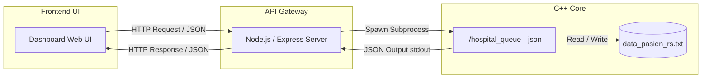

# Web UI Integration Implementation Plan (Option A)

This document details the architecture, data flow, and design specifications for integrating a modern web interface with the modular C++ queue system using the approved **Subprocess Spawn CLI with JSON** approach.

---

## 1. Architectural Overview

The system follows a three-tier architecture:
1. **Frontend (Presentation Layer)**: Built with HTML5, CSS3 (rich, glassmorphic layout), and Javascript (React or modern Vanilla JS) to provide a premium administrative dashboard.
2. **Backend Wrapper (API Bridge Layer)**: A lightweight Node.js/Express server that exposes REST endpoints and spawns the compiled C++ executable as a subprocess, passing JSON arguments.
3. **Core Engine (Logic Layer)**: The compiled modular C++ executable (`hospital_queue`) which handles queue operations using Priority Queue and Hash Table, and outputs JSON responses.



---

## 1.5 Dual Execution Modes (CLI vs JSON)

To ensure that the system can be run and tested either via a standard terminal command line or via the Web UI, the C++ executable supports two modes of execution:

1. **Interactive CLI Mode (Default)**:
   * **Trigger**: Run without arguments: `./hospital_queue`
   * **Behavior**: Launches the fully interactive terminal menu (supporting manual inserts, calls, updates, deletes, and dummy data generation) with standard console input and output.
2. **JSON API Mode**:
   * **Trigger**: Run with the `--json` flag: `./hospital_queue --json '{"action": ...}'`
   * **Behavior**: Parses the command in JSON format, executes it, writes the JSON result directly to `stdout`, and exits immediately. This mode is consumed by the Node.js API gateway.

---

## 2. Communication Protocol (JSON CLI)

The C++ executable will accept commands via the `--json` command-line argument. The payload will be a single stringified JSON object. Output will be sent to `stdout` in JSON format.

### Command Payloads & Output Structure

#### A. Insert Patient
* **Request Command:**
  ```json
  {
    "action": "insert",
    "id": "P101",
    "nama": "Ahmad Dani",
    "layanan": "Poli Penyakit Dalam",
    "prioritas": 2,
    "waktuDatang": "10:30"
  }
  ```
* **Success Response:**
  ```json
  {
    "status": "success",
    "message": "Pasien berhasil ditambahkan ke antrian.",
    "data": {
      "id": "P101",
      "nomorAntrian": 6,
      "prioritasLabel": "Mendesak"
    }
  }
  ```

#### B. Call Next Patient
* **Request Command:**
  ```json
  {
    "action": "call_next"
  }
  ```
* **Success Response:**
  ```json
  {
    "status": "success",
    "message": "Pasien dipanggil.",
    "data": {
      "id": "P101",
      "nama": "Ahmad Dani",
      "layanan": "Poli Penyakit Dalam",
      "prioritas": 2,
      "nomorAntrian": 6,
      "waktuDatang": "10:30",
      "status": "Dipanggil"
    }
  }
  ```

#### C. Search Patient
* **Request Command:**
  ```json
  {
    "action": "search",
    "id": "P101"
  }
  ```

#### D. Update Status
* **Request Command:**
  ```json
  {
    "action": "update_status",
    "id": "P101",
    "status": 2
  }
  ```

#### E. Cancel/Delete Patient
* **Request Command:**
  ```json
  {
    "action": "delete",
    "id": "P101"
  }
  ```

#### F. List Patients (All or Waiting)
* **Request Command:**
  ```json
  {
    "action": "list_all"
  }
  ```
  *or*
  ```json
  {
    "action": "list_waiting"
  }
  ```

---

## 3. Node.js Wrapper Design

A simple router in Express will invoke the C++ backend:

```javascript
const { spawn } = require('child_process');

app.post('/api/queue', (req, res) => {
    const payload = JSON.stringify(req.body);
    const child = spawn('./hospital_queue', ['--json', payload]);

    let output = '';
    let errorOutput = '';

    child.stdout.on('data', (data) => {
        output += data.toString();
    });

    child.stderr.on('data', (data) => {
        errorOutput += data.toString();
    });

    child.on('close', (code) => {
        if (code !== 0) {
            return res.status(500).json({
                status: 'error',
                message: 'C++ backend crashed',
                error: errorOutput
            });
        }
        try {
            res.json(JSON.parse(output));
        } catch (e) {
            res.status(500).json({
                status: 'error',
                message: 'Failed to parse C++ response',
                raw: output
            });
        }
    });
});
```

---

## 4. UI/UX Design & Aesthetic Specifications

To align with modern high-premium standards, the Web UI will utilize the following system rules:

* **Typography**: Outfit or Inter Google Fonts for a sleek, clean interface.
* **Palette**: Sleek slate/dark base background (`#0b0f19`) paired with subtle glassmorphic panels (backdrop-filters, light borders, dark translucency).
* **Priority Color Coding**:
  * **Darurat (1)**: Bright Crimson/Red (`#ef4444`) with a soft pulse animation.
  * **Mendesak (2)**: Warning Orange (`#f97316`).
  * **Rentan (3)**: Soft Amber/Yellow (`#eab308`).
  * **Reguler (4)**: Premium Emerald/Cyan (`#14b8a6`).
* **Visual Components**:
  * **Calling Deck**: A giant, elegant card showing the patient currently being served, complete with a "Selesai" and "Next Patient" control.
  * **Form Registration**: Semi-transparent floating form inputs with custom styling.
  * **Real-time Queue Table**: Interactive rows showing waiting, active, finished, and cancelled patients.
  * **Performance & Benchmark Tab**: Visualizes execution times for Priority Queue vs. Standard Queue across 100, 1000, and 10000 data inputs using a clean SVG-rendered bar chart or Chart.js line graph.
